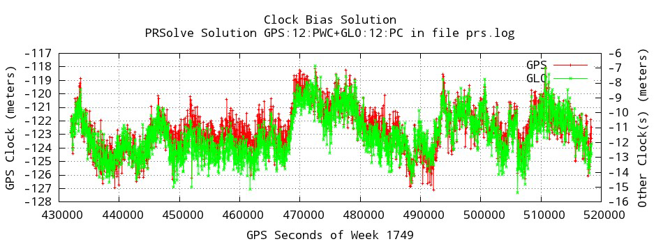
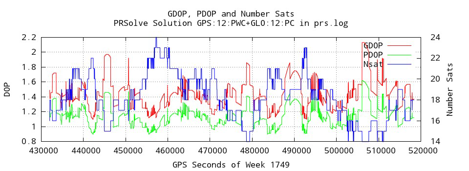
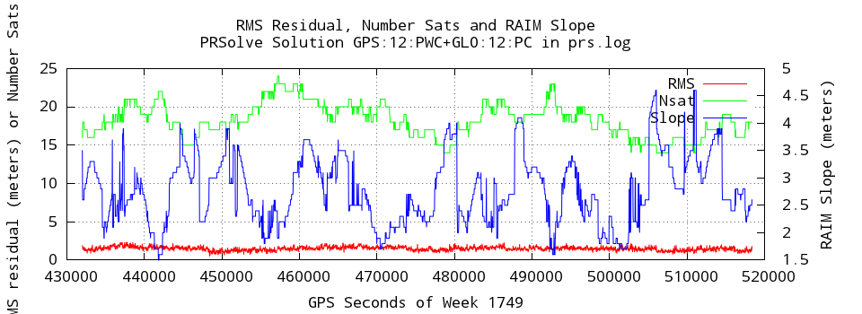
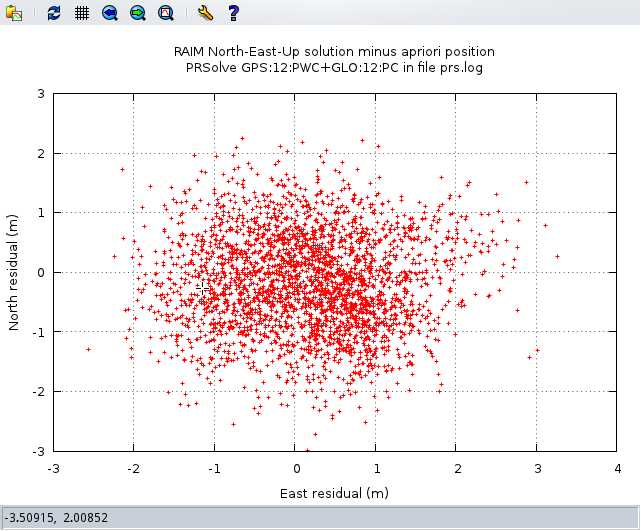
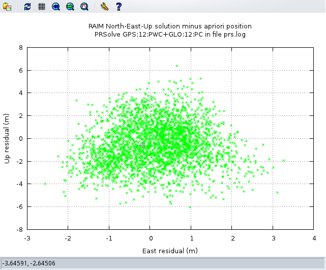
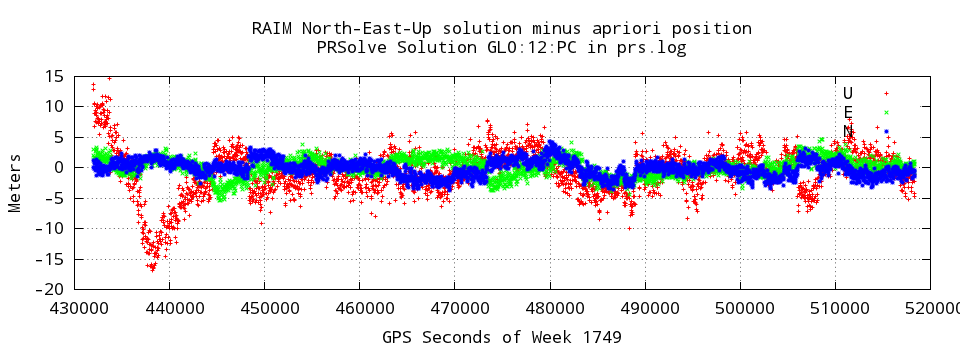
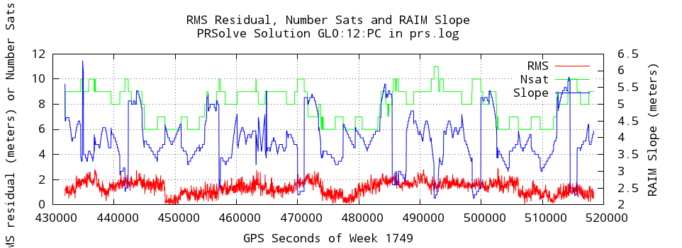

positioning - poscvt
====================

This application allows the user to convert among different coordinate systems on the command
line. Coordinate systems handled include Cartesian, geocentric, and geodetic.

Usage:
------

### Optional Arguments

Short Arg.| Long Arg.| Description

    -d    –debug                Increase debug level.
    -v    –verbose              Increase verbosity.
    -h    –help                 Print help usage.
          –ecef=POSITION        ECEF “X Y Z” in meters.
          –geodetic=POSITION    Geodetic “lat lon alt” in deg, deg, meters.
          –geocentric=POSITION  Geocentric “lat lon radius” in deg, deg, meters.
          –spherical=POSITION   Spherical “theta, pi, radius” in deg, deg, meters.
    -l    –list-formats         List the available format codes for use by theinput and output format options.
    -F    –output-format=ARG    Write the position with the given format.
    
Examples:
---------

    > poscvt --ecef="4345070.59253 45619878.26297 803.598856837"
        ECEF (x,y,z) in meters 4345070.5925 45619878.2630 803.5989
        Geodetic (llh) in deg, deg, m 0.00100566 84.55926933 39448197.4795
        Geocentric (llr) in deg, deg, m 0.00100472 84.55926933 45826334.4795
        Spherical (tpr) in deg, deg, m 89.99899528 84.55926933 45826334.4795

Notes:
------
If no options are given poscvt assumes XYZ 0 0 0.

-----------------------------------------------------------------------------------------------------------------------

positioning - PRSolve
==================== 

This application computes a navigation (position and clock) solution from the pseudorange data of several 
satellites contained in RINEX (version 2 or 3.02) format observation files. A Receiver Autonomous Integrity Monitoring 
or RAIM algorithm is included in the processing but may optionally be omitted. The solution is independently computed 
at each time tag; there is no filtering or other connection between solutions at different times.

Usage:
------

    > PRSolve [options]
        In the log file, results at each time tag appear in lines with the format:
          "TAG descriptor LABEL week sec.of.week CONTENT (code) [N]V"
        where TAG denotes the type of solution or solution residuals:
          RPF RAIM ECEF XYZ solution
          RPR RAIM ECEF XYZ solution residuals [only if --ref given]
          RNE RAIM North-East-Up solution residuals [only if --ref given]
          SPS Simple ECEF XYZ solution [only if --SPSout given]
          SPR Simple ECEF XYZ solution residuals [only if both SPS & ref given]
          SNE Simple North-East-Up solution residuals [only if SPS & ref given]
        and LABEL followed by CONTENT is:
          NAV X Y Z SYS clock_bias [SYS clock_bias ...]
          POS X Y Z
          CLK SYS clock_bias [SYS clock_bias ...]
          RMS Nrej Ngood RMS TDOP PDOP GDOP Slope niter conv SAT [SAT ...]
          DAT Ngood Nsats <SAT>:<freq><code> ... (list of sats with freq+code found)
        and where
          X Y Z = position solution, or solution residuals, depending on TAG;
          RNE and SNE yield North-East-Up residuals, at --ref position
          SYS = system or GNSS, e.g. GPS GLO GAL ... (identifies system of clock bias)
          Nsats = number of satellites in the RINEX file at this time
          Ngood = number of satellites used in the solution algorithm
          Nrej = number of satellites rejected by the RAIM algorithm
          RMS = RMS residual of fit (meters)
          Slope = RAIM 'slope' value
          xDOP = Dilution of precision (T=time, P=position, G=geometric=T+P)
          niter = number of iterations performed by the solution algorithm
          conv = final convergence value (delta RMS position) of the solution algorithm
          SAT = satellite identifier (e.g. G10, R07); minus sign means rejected
          CODE = return value from solution algorithm (with words if --verbose)
          [N]V = V for valid solution, NV for not valid (don't use!)
      
        Default values appear in () after options below.
    
      # Input via configuration file:
        --file <fn> Name of file with more options [#->EOL = comment] [repeat] ()
      # Required input data and ephemeris files:
        --obs <fn> RINEX observation file name(s) [repeat] ()
        --eph <fn> Input Ephemeris+clock (SP3 format) file name(s) [repeat] ()
        --nav <fn> Input RINEX nav file name(s) (also cf. --BCEpast) [repeat] ()
      # Other (optional) input files
        --clk <fn> Input clock (RINEX format) file name(s) [repeat] ()
        --met <fn> Input RINEX meteorological file name(s) [repeat] ()
        --dcb <fn> Input differential code bias (P1-C1) file name(s) [repeat] ()
        --ant <fn> Input ANTEX antenna file name(s) [repeat] ()
      # Paths of input files:
        --obspath 
 Path of input RINEX observation file(s) ()
        --ephpath 
 Path of input ephemeris+clock file(s) ()
        --navpath 
 Path of input RINEX navigation file(s) ()
        --clkpath 
 Path of input RINEX clock file(s) ()
        --metpath 
 Path of input RINEX meteorological file(s) ()
        --dcbpath 
 Path of input DCB (P1-C1) bias file(s) ()
        --antpath 
 Path of input ANTEX antenna file(s) ()
      # Editing [t(time),f(format) = strings; default wk,sec.of.wk OR YYYY,mon,d,h,min,s]
        --start <t[:f]> Start processing data at this epoch ([Beginning of dataset])
        --stop <t[:f]> Stop processing data at this epoch ([End of dataset])
        --decimate <dt> Decimate data to time interval dt (0: no decimation) (0.00)
        --elev <deg> Minimum elevation angle (deg) [--ref or --forceElev req'd] (0.00)
        --forceElev Apply elev mask (--elev, w/o --ref) using sol. at prev. time tag (don't)
        --antenna <name> Name for Rx antenna in ANTEX file; if found, correct for Rx PCO ()
        --exSat <sat> Exclude this satellite [eg. G24 | R | R23,G31] [repeat] ()
        --BCEpast Use 'User' find-ephemeris-algorithm (else nearest) (--nav only) (don't)
      # Solution Descriptors <S:F:C> define data used in solution algorithm
        --sol <S:F:C> Specify data System:Freqs:Codes to be used to generate solution(s) [repeat] ()
        --SOLhelp Show more information on --sol <Solution Descriptor> (don't)
      # Solution Algorithm:
        --wt Weight the measurements using elevation [--ref req'd] (don't)
        --rms <lim> Upper limit on RMS post-fit residual (m) (6.50)
        --slope <lim> Upper limit on maximum RAIM 'slope' (1000.00)
        --nrej <n> Maximum number of satellites to reject [-1 for no limit] (-1)
        --niter <lim> Maximum iteration count in linearized LS (10)
        --conv <lim> Maximum convergence criterion in estimation in meters (3.00e-07)
        --Trop <m,T,P,H> Trop model <m> [one of Zero,Black,Saas,NewB,Neill,GG,GGHt
      with optional weather T(C),P(mb),RH(%)] (NewB,20.0,1013.0,50.0)
      # Output [for formats see GPSTK::Position (--ref) and GPSTK::Epoch (--timefmt)] :
        --log <fn> Output log file name (prs.log)
        --out <fn> Output RINEX observations (with position solution in comments) ()
        --ver2 In output RINEX (--out), write RINEX version 2.11 [otherwise 3.01] (don't)
        --ref <p[:f]> Known position p in fmt f (def. '%x,%y,%z'), for resids, elev and ORDs ()
        --SPSout Output autonomous pseudorange solution [tag SPS, no RAIM] (don't)
        --ORDs <fn> Write ORDs (Observed Range Deviations) to file <fn> [--ref req'd] ()
        --timefmt <f> Format for time tags in output (%4F %10.3g)
      # Diagnostic output:
        --verbose Print extended output information (don't)
        --debug Print debug output at level 0 [debug<n> for level n=1-7] (-1)
        --help Print this and quit (don't)

When PRSolve is run without any command line arguments, or with the --help option, it produces a "help" or 
"syntax page" (Appendix A). Almost all the information needed to run PRSolve is found on the syntax page. 
This documentation is meant as a supplement to, not a replacement for, the syntax page; it assumes you are 
familiar with the syntax page. *(Note that the syntax page is likely to be updated more frequently than is this 
document.)*

The syntax page begins with a brief description of the program, then describes the records found in
its output, then finally lists each option and its argument (if it has one) followed by a brief description,
with the default value in parentheses. 

Most options have no default and so the parentheses are empty "()". Also "[repeat]" may appear, meaning the option 
is allowed to appear more than once on the command line (otherwise an error is generated). Options may appear in any 
order on the command line. Also, options may be placed in a text file, and then applied together with the single 
option '--file <filename>' (comments beginning with # are also allowed in this file).

Required Input:
---------------

The minimum required input consists of a RINEX observation file (--obs) and corresponding ephemeris input 
(--eph or –nav) plus a solution descriptor (--sol). All other input is optional. Input RINEX clock files (--clk) 
will override the clock information in the ephemeris input. 

The path of the input files may be specified separately from the file name; that is, the following lines of input
    
    --eph /home/user/eph/igs15505.sp3 --eph /home/user/eph/igs15506.sp3
    --eph igs15505.sp3 --eph igs15506.sp3 --ephpath /home/user/eph
    --eph igs15505.sp3,igs15506.sp3 --ephpath /home/user/eph
are all equivalent. Note that the two file names may appear either with their own option (--eph), as in
the second line, or separated by a comma following a single option, as in the third line. If the data in
these files does not match the time tags in the RINEX observation file, a Warning or Error will be issued 
in the log file. *It is the user's responsibility to ensure that these input files are consistent, i.e. that
they are in the same frame (ITRF, WGS84, etc.) and they are appropriate to the data.*

Solution Descriptors:
---------------------

PRSolve can simultaneously compute more than one solution at each time tag. The satellite systems and data types 
used in each solution are determined by the "solution descriptor," and are input with the --sol <descriptor> 
option (see syntax page and the --SOLhelp option); this string also labels the output. The solution descriptor 
is a string of the form "GPS:12:WC" consisting of three parts, system, frequency(ies) and code(s), separated by 
colons (:). The data used to compute the solution consists of all the pseudoranges in the data from the given system, 
frequency and code.

"System" means satellite system or GNSS; namely GPS, GLONASS, Galileo, BeiDou, etc.; run PRSolve with the --SOLhelp 
option, or see Appendix A, for supported systems. If two frequency digits appears, then an ionosphere-free linear 
combination of data from the two frequencies is formed; for example frequency "12" implies the usual linear combination 
of L1 and L2 that eliminates the ionospheric delay. Frequencies must be available for the given system, of course. 
Currently triplefrequency solutions are not supported.

The codes in the descriptor consist of characters which give RINEX tracking codes (cf. the --SOLhelp option or Appendix 
A). The codes input is ordered, meaning that PRSolve will choose the first code in the code string (moving left to right) 
that is found in the data. Data from different systems may be combined into a single solution. The solution descriptor in 
this case is two component descriptors separated by a '+', for example GPS:12:PWC+GLO:12:PC. In such a combined solution 
the data from both systems (as given in each component descriptor) is combined together to form a single solution. 
*(Note that in the case of GPS+GLO, a separate clock solution for each system is required; PRSolve handles this 
automatically.)*

Multiple solution descriptors are given by multiple --sol options (--sol is repeatable), or as a single argument, separated 
by commas. For example, input of either 
    
    --sol GPS:12:PYXWC+GLO:12:PC --sol GPS:15:WXLC
or
    
    --sol GPS:12:PYXWC+GLO:12:PC,GPS:15:WXLC
will cause PRSolve to compute two solutions, the first being a combination of GPS and GLONASS data, using an ionosphere-
free combinations of L1 and L2, with tracking codes P,Y,X,W, or C for GPS, and codes P or C for GLONASS. The second 
solution produced by PRSolve will be GPS-only, L1/L5 ionosphere-free combination, using whichever pseudoranges with codes 
W,X,L or C (in that order) are found in the data. *(Note that the actual code chosen at each epoch is given in the DAT 
output line; see below.)* 

    >./PRSolve --SOLhelp
      PRSolve, part of the GPS Toolkit, Ver 5.0 8/1/13, Run 2013/08/15 11:29:04
      === Help for Solution Descriptors, option --sol <S:F:C> ===
      The --sol option is repeatable, so all --sol solutions, if valid,
      will be computed and output in one run of the program.
    
      Solution descriptors are of the form S:F:C where
        S is a system, one of: GPS GLO GAL GEO BDS QZS
        F is a frequency, one of: 1 2 3 5 6 7 8
        C is an ordered set of one or more tracking codes, for example WPC
        These must be consistent - not all F and C apply to all systems.
    
      The S:F:C are the RINEX codes used to identify pseudorange observations.
        Valid PR tracking codes for systems and frequencies:
        freq| GPS | GLO | GAL | GEO | BDS | QZS
        1 | PYWLMIQSXC | PC | ABCIQXZ | C | --- | CSLXZ
        2 | PYWLMIQSXCD | PC | --- | --- | IQX | SLX
        3 | --- | IQX | --- | --- | --- | ---
        5 | IQX | --- | IQX | IQX | --- | IQX
        6 | --- | --- | ABCIQXZ | --- | IQX | SLX
        7 | --- | --- | IQX | --- | IQX | ---
        8 | --- | --- | IQX | --- | --- | ---
  
      Example solution descriptors are GPS:1:P GLO:3:I BDS:7:Q
        These are single-frequency solutions, that is the GPS:1:P solution will use GPS L1 P-code 
        pseudorange data to find a solution.
      Dual frequency solutions are allowed; they combine data of different frequencies to eliminate 
      the ionospheric delay, for example
          GPS:12:PC is the usual L1/L2-ionosphere-corrected GPS solution.
      Triple frequency solutions are not supported.
    
      More that one tracking code may be provided, for example GPS:12:PC
        This tells PRSolve to prefer P, but if it is not available, use C.
    
      Finally, combined solutions may be specified, in which different data types, even from 
      different systems, are used together.
      The component descriptors are combined using a '+'. For example
          GPS:12:PC+GLO:12:PC
      describes a dual frequency solution that uses both GPS and GLO
      L1/L2 P-code (or C/A) data in a single solution algorithm.

Configuring the Algorithm:
-------------------------- 

PRSolve uses an iterated linearized least squares algorithm to compute the navigation (position + clock(s)) solution. 
The user is able to configure this algorithm using command line input as follows (see the syntax page starting with # 
Solution Algorithm). The defaults for these options are carefully chosen based on a lot of experience, and should be 
changed only with great care.
The option --wt causes the pseudorange measurements to be weighted based on their elevation angle; the weight is defined as

    wt = 1 (elev >= 30 degrees)
    wt = [sin(elev)/sin(30)]^2 (elev < 30 deg)
Of course elevations below zero are excluded. This option is quite expensive in terms of computation
time.

The options --niter and --conv control the iteration loop; --niter gives the maximum number of iterations allowed 
(default 10), and --conv gives a limit on the RMS change in the position solution. If the number of iterations is exceeded 
then iteration stops and the solution is marked bad. If the change is less than the --conv limit then iteration stops and 
the solution is marked good. (The RMS output shows the actual values produced by the algorithm; see below.)

The RAIM algorithm used by PRSolve (“A Baseline GPS RAIM Scheme and a Note on the Equivalence of Three RAIM Methods," 
by R. Grover Brown, Journal of the Institute of Navigation, Vol. 39, No. 3, Fall 1992, pg 301) operates simply by computing 
many different solutions with different satellites until a good solution is found. “Good solution” is defined as one with 
post fit RMS residual less than the limit given by the --rms option. If all the data does not produce a good solution,
then the algorithm computes solutions with rejected satellites, first each satellite rejected in turn, and then with pairs 
of satellites rejected in turn, and so on, until either a good solution is found, a given maximum number of satellites is 
rejected, or there is not enough data to proceed. This limit on the number of satellites that may be rejected by the RAIM 
algorithm is given by the --nrej option; if this limit is -1, then no limit is applied. (The RMS output gives the number of 
rejected satellites and which satellites were rejected, in the final RAIM solution; see below.)

The least squares algorithm yields an RMS post-fit pseudorange residual; if this value exceeds the limit given by --rms then 
the solution is marked suspect. The RAIM algorithm also produces a quantity called 'slope'; if this value exceeds the limit 
given by --slope then the solution is marked suspect.

Tropospheric Model and Weather Input:
-------------------------------------

PRSolve corrects the measured pseudoranges for tropospheric delay using a standard model and weather parameters. The tropospheric 
model and default weather parameters may be input using the --Trop option. Weather information in the form of RINEX
meteorological files may be input with the --met option. If no meteorological files are input, the default weather parameters 
are used.

The argument of the --Trop option is a string of 4 fields separated by commas: a key giving the model name, and three numbers 
for the temperature (degrees C), pressure (millibars) and relative humidity (%). The default for this option is 'NewB,20.0,1013.0,
50.0'. The accepted keys with the corresponding model are (also see syntax page)

    Zero This is a “dummy” model that always returns a zero correction; used for testing
    Black A simple Black model
    Saas The Saastamoinen model
    NewB New Brunswick UNB3 model
    Neill Neill model
    GG The model of Goad and Goodman
    GGHt The GG model with an explicit height dependence
Some of these models (Saas, Neill, NewB) require the height (altitude) and latitude of the receiver and the day of year; PRSolve 
will give it this information when it has a reference position (--ref) and a start or stop time (--start or --stop). Note that the 
NewB model computes it own weather parameters given the latitude and day of year. For more information on these tropospheric models, 
see class TropModel in the GPS Toolkit.

Reference position input:
-------------------------

The --ref option gives PRSolve a "reference" position for the solution; this should be the known "correct" position, or at 
least a good guess. The reference position is not used in the computation and does NOT affect the computed solution, but it 
does allow PRSolve to compute residuals (the difference between the solution position and this reference position), and to rotate 
the solution residuals into local topocentric (North-East-Up) coordinates (see RPR and RNE output records, below). The argument 
for --ref is just the position coordinates separated by commas; thus for example
    
    --ref -740311.8581,-5457066.4731,3207249.3343
is acceptable; this assumes the coordinates are Earth-centered, Earth-fixed Cartesian (ECEF XYZ) with units meters. The --ref 
argument must specify a complete geodetic position.

Other coordinates and/or units may be used, by supplying a format description, after a colon (:), along with the corresponding 
coordinates (--ref <data:format>, see the syntax page); the meanings of the format descriptors come from class Position in the GPS 
Toolkit; they are as follows. Note that the default format is “%x,%y,%z”.
    
    %x Position::X() (meters)                          ECEF X coordinate meters
    %y Position::Y() (meters)                          ECEF Y coordinate meters
    %z Position::Z() (meters)                          ECEF Z coordinate meters
    %X Position::X()/1000 (kilometers)                 ECEF X coordinate km
    %Y Position::Y()/1000 (kilometers)                 ECEF Y coordinate km
    %Z Position::Z()/1000 (kilometers)                 ECEF Z coordinate km

    %A Position::geodeticLatitude() (degrees North)    Geodetic latitude deg N
    %a Position::geocentricLatitude() (degrees North)  Geocentric latitude deg N
    %L Position::longitude() (degrees East)            Longitude deg East
    %l Position::longitude() (degrees East)            Longitude deg East
    %w Position::longitude() (degrees West)            Longitude deg West
    %W Position::longitude() (degrees West)            Longitude deg West
    %h Position::height() meters                       Height above ellipsoid m
    %H Position::height()/1000 kilometers              Height above ellipsoid km

    %t Position::theta() (degrees)                     Spherical coord theta deg
    %T Position::theta() (radians)                     Spherical coord theta rad
    %p Position::phi() (degrees)                       Spherical coord phi deg
    %P Position::phi() (radians)                       Spherical coord phi rad
    %r Position::radius() meters                       Spherical coord radius m
    %R Position::radius()/1000 kilometers              Spherical coord radius km

(On Windows, '%' is a special character on the command line; make it an ordinary character by entering it twice, e.g. “%%x,%%y,%%z”.)

Thus, other possibilities for the --ref argument above would be
    
    --ref -740311.8581,-5457066.4731,3207249.3343:%x,%y,%z # the default format
    --ref 30.216754900,97.726379400,6372918.624:%a,%w,%r # geocentric LL(W)H
    --ref 30.384393671,262.273620600,218.412:%A,%l,%h # geodetic LL(E)H
    --ref 59.783245100,262.273620600,6372918.624:%t,%p,%r # spherical theta,phi,rad

Other optional input:
---------------------

PRSolve accepts some options that edit the data in various ways. PRSolve will ignore data in the input RINEX observation file 
that are outside time limits given by --start and --stop, each followed by a time. The time argument may be given as "week,seconds-of-week" 
or as "year,month,day,hour,minute,seconds", or as another form given by a format included after a colon (:) in the argument. The format 
descriptors are taken from class Epoch in the GPS Toolkit; the defaults are '%F,%g' and '%Y,%m,%d,%H,%M,%S'. Here are some examples.
    
    --stop 2009,9,23,18,1,2 --start 1550,280800
    --start 1550,299999.000 --stop 2009,9,23,12,0,1
    --start 1550,280800.:%F,%g --stop 55098.23487024:%Q
    --stop "2009 9 23 18 1 2:%Y %m %d %H %M %S"
Note that there must be quotes around any argument that include spaces. Also note that the format does not have to include commas; 
however the  data before the colon must fit into the format after the colon. Again, on Windows you must double up the %, for example 
“%%F %%g”. The input  observation data can be decimated down to time spacing dt by specifying --decimate dt. For example, if the RINEX 
Observation file has an interval  of 30 seconds but you want to compute solutions only every 5 minutes (300 seconds), the input 
'--decimate 300' would cause PRSolve to do that. Note  that the start time of the decimation is determined by the --start option, or 
if that is not available, then seconds-of-week that are even multiples of dt are used. In other words, 
    
    --decimate 300 
alone produces results at seconds-of-week 0, 300, 600, ... 345000, 345300, 345600, ... 604500 (as they exist in the data); but if you had
    
    --decimate 300 --start 1550,345030.0
then PRSolve would produce solutions at seconds-of-week 30, 330, ..., 345030, 345330, 345630, ... (as they exist in the data).

The option --elev <deg> forces satellites below elevation angle <deg> to be eliminated. This option requires that a reference position (--ref) 
be given; then the elevation angle is computed, independent of, and before, the solution algorithm, using the reference position for the receiver. 
If --ref is not given but --forceElev is given, then PRSolve uses the latest computed position to compute the elevation angle, and then applies 
the mask. Note that with --forceElev there may be some time tags initially when there is no solution and so the mask cannot be applied; also if a 
solution is very poor then the masking may consequently be inappropriate, but this should not happen with a good amount of data.

Individual satellites may be excluded from the data stream using the option --exSat. The argument of this option is a RINEX-style satellite 
identifier; for example
    
    --exSat R9 --exSat G01 # option is repeatable
    --exSat R9,G01,G17 # comma-separated list works
    --exSat R # exclude entire system R (GLONASS)
The last example excludes ALL GLONASS (R) satellites (although this command is redundant if the solution descriptors do not contain the system GLO). 
*[Note that the supported systems and their RINEX identifiers are GPS:G GLONASS:R Galileo:E SBAS or Geocentric:S and BeiDou:C.]*

Computation of ORDs:
--------------------

An Observed Range Deviations (ORD) is simply the difference of the measured pseudorange and the pseudorange computed using the position+clock 
solution. PRSolve will compute ORDs and write them to a file named in the argument of the option --ORDs if such an option is input. This 
requires that a reference position (--ref) be given. The format of the output file is as follows (there were three solutions computed, hence 
three sets of ORDs).
    
    ORD sat week sec-of-wk elev iono ORD1 ORD2 ORD Solution_descriptor
    ORD G01 1550 259200.000 18.795 8.022 8.928 14.118 0.906 GPS:12:WC
    ORD G02 1550 259200.000 71.229 4.297 9.568 12.348 5.271 GPS:12:WC
    ORD G04 1550 259200.000 46.999 9.135 10.853 16.763 1.718 GPS:12:WC
    (… the rest of the satellites at this time, solution)
    ORD R07 1550 259200.000 20.925 18.298 36.885 48.835 18.587 GLO:12:PC
    ORD R10 1550 259200.000 8.977 35.663 46.160 69.450 10.497 GLO:12:PC
    ORD R11 1550 259200.000 27.755 25.970 40.286 57.246 14.316 GLO:12:PC
    (… the rest of the satellites at this time, solution)
    ORD G01 1550 259200.000 18.795 8.022 9.281 14.471 1.258 GPS+GLO:12:WC+PC
    ORD G02 1550 259200.000 71.229 4.297 9.921 12.701 5.624 GPS+GLO:12:WC+PC
    ORD G04 1550 259200.000 46.999 9.135 11.206 17.116 2.071 GPS+GLO:12:WC+PC
    ORD R07 1550 259200.000 20.925 18.298 24.070 36.020 5.771 GPS+GLO:12:WC+PC
    ORD R10 1550 259200.000 8.977 35.663 33.344 56.634 -2.319 GPS+GLO:12:WC+PC
    ORD R11 1550 259200.000 27.755 25.970 27.471 44.431 1.501 GPS+GLO:12:WC+PC
    (… the rest of the satellites at this time, solution)
    ORD G01 1550 259210.000 18.859 7.899 7.496 12.606 -0.403 GPS:12:WC
    ORD G02 1550 259210.000 71.194 5.024 6.431 9.681 1.407 GPS:12:WC
    ORD G04 1550 259210.000 46.932 9.104 7.740 13.630 -1.364 GPS:12:WC
    ORD G05 1550 259210.000 34.404 7.960 10.758 15.908 2.797 GPS:12:WC
    ORD G09 1550 259210.000 17.533 12.227 12.650 20.560 0.423 GPS:12:WC
    (...)
The first line in the file is a header that identifies the columns. Note that all lines start with the tag 'ORD', the satellite ID 
(RINEX style) and the time in week and seconds-of-week. This is followed by the elevation angle of the satellite in degrees, the 
ionospheric delay (at L1, the first frequency) in meters. There are three ORDs computed, the first, ORD1, is computed using the 
pseudorange at the first frequency (L1 here – note the solution descriptor) while ORD2 uses the second. The third one, labeled ORD, 
uses the ionosphere-free combination of the two measured pseudoranges. Finally the line includes the solution descriptor.

Output to a RINEX file: 
-----------------------

The option --out <filename> causes PRSolve to write an output RINEX (ver. 3.02) observation file. This file will be the same as the 
input file except for small changes in the header and the addition of auxiliary header information, at each time tag, in the form of 
comments that contain the PRSolve navigation solution(s). That is, the output RINEX file will include, at each epoch, a block like the 
following.
    
    > 2009 09 23 00 02 0.0000000 4 9
        XYZ -740312.118 -5457067.840 3207248.661 GPS:12:WC COMMENT
        CLK GPS -19598.442 GPS:12:WC COMMENT
        DIA11 2.57 3.25 2.07 GPS:12:WC COMMENT
        XYZ -740313.050 -5457053.843 3207245.768 GLO:12:PC COMMENT
        CLK GLO -19654.477 GLO:12:PC COMMENT
        DIA 5 35.21 43.21 1.14 GLO:12:PC COMMENT
        XYZ -740312.884 -5457067.601 3207248.781 GPS+GLO:12:WC+PC COMMENT
        CLK GPS -19598.289 GLO -19648.020 GPS+GLO:12:WC+PC COMMENT
        DIA16 2.18 3.40 2.05 GPS+GLO:12:WC+PC COMMENT
This is a standard RINEX epoch line (> 2009 … 4 9) with epoch flag 4 followed by 9 comment lines. Note that there are three lines for 
each solution descriptor. The XYZ line gives the ECEF XYZ solution in meters, followed by the descriptor. The CLK line gives the clock 
solution in meters, preceded by the system to which it applies, for each system included in the solution, followed by the descriptor again. 
Finally the DIA line includes the number of satellites, followed by the PDOP, GDOP and the RMS residual of fit and the descriptor. Note 
that RINEX comments are limited to 60 characters, and so it may happen that very long solution descriptors will get truncated. There are 
other RINEX tools in the GPS Toolkit that will read and make use of these position-clock comments.

PRSolve log file output: 
------------------------

PRSolve produces a large amount of output to a log file (--log with default prs.log). Anything unexpected or anomalous will be noted 
with a line beginning with “Warning” or (if the problem is critical) “Error”; *whenever PRSolve does not give good results, the log file 
should be searched for these two words.* 

Otherwise, there are three types of output  
*   1) a dump of the input configuration and input file content, at the top of the file  
*   2) solutions and diagnostic information at each time tag  
*   3) statistics and a weighted average solution at the bottom of the file  
The log file ends with a line starting with "PRSolve timing:" and including both the processing (CPU) time used and the "wall clock"
timing; the weighted average and timing information are also printed on the screen.

The configuration is dumped to the log file in a format similar to the syntax page; this tells you exactly what PRSolve found the 
input to be. This is followed by various summaries and dumps of thecontent of the input files. The verbose option (--verbose) causes more of 
this information to be produced, including file headers and summaries of the ephemeris input, etc. A dump of the header of the input RINEX 
observation file is here; it gives e RINEX observation types for all the data in the file, which may be useful in providing codes for 
--sol input option. Before processing (between outputs (1) and (2)), each solution descriptor is printed in the log file after the tag 
'SOLN'; if the solution descriptor is invalid for any reason, this will be indicated at this point and the solution descriptor will 
then be ignored in the processing.

Output per time tag:
--------------------

Each solution descriptor yields several lines of output, each with a different label, at each time tag in the input RINEX observation 
file. The lines are of the following form (this output is described on the syntax page; the comments below are meant to augment that 
description).  
  
  TAG descriptor LABEL week sec-of-week CONTENT (code) [N]V  
  
At minimum you will get output for TAG RPF and LABELs DAT, NAV and RMS. Tag "RPF" means the RAIM final solution, which is the solution 
produced by the least squares algorithm. The NAV content consists of the position, in Earth-centered, Earth-fixed Cartesian coordinates 
(ECEF XYZ), and clock biases, with units meters. [Note that the frame (ITRF, WGS84, etc.) of the solution is determined by the frame of 
the input satellite ephemeris (--eph or –nav).]

For example (the line is necessarily wrapped here, even though it is a single line in the log file):
    
    RPF GPS:12:WC NAV 1550 259300.000 -740311.906314 -5457065.109818 3207248.819548 GPS -19600.074 (0 ok) V
This is a GPS ionosphere-free L1/L2 solution with (X,Y,Z = -740311.906314, -5457065., 3207248.819548) meters and a GPS clock bias of 
-19600.074 meters. There were no problems with this solution "(0 ok)" and it is valid "V". The clock bias is preceded by the system to 
which it applies; if more than onesystem (GNSS) was used in the solution, then there will be more than one clock bias; for example
    
    RPF GPS:12:WC+GLO:12:PC NAV 1550 259300.000 -740312.591550 -5457064.512332 3207247.908676 GPS -19600.297 GLO -19650.258 (0 ok) V
This is a combined GPS and GLONASS solution similar to the previous one. [The solution for two clock biases here is equivalent to solving 
for the GPS-GLONASS system time offset, which must be done whenever GPS and GLONASS data is mixed.]

POS records are very similar to NAV records; they simply omit the clock solution(s). These are used to output residuals (RPR or RNE, 
see below). CLK records output only the clock solution(s) [they may not appear in the current version].

The record labeled DAT indicates which satellites were present in the data, which were used, and which RINEX tracking code applies to 
the pseudorange that was actually used in the algorithm. Thus 
    
    RPF GPS:12:WC DAT 1550 259300.000 11 11 G01:1W2W G02:1W2W G04:1W2W G05:1W2W G09:1W2W G10:1W2W G12:1W2W G17:1W2W G24:1W2W G27:1W2W G30:1W2W
shows that 11 satellites had sufficient data, and that there are 11 satellites present; on frequency L1 code W was used (1W) and on L2 
it was also W (2W). If, say, GPS satellite PRN 17 had been present but code W was not available on L1 while code C was, then you would 
see 'G17:1C2W'. If in addition there were NO pseudorange on L2 for G17, you would see instead '-G17:1C2-' and the satellite G17 would not be part 
of the solution (-G17 means G17 was not used; 2- means there were no acceptable codes on L2). Also in this case '11 11' would be replaced with '10 11'.

The output labeled with RMS contains a lot of information about the operation of the solution algorithm; a labeled example is provided 
here (again wrapping is necessary but a bother here):
    
    RPF descriptor week sec.of.week n N RMSresid TDOP PDOP GDOP slope niter conv sats ('-' means rejected) ... (code) Valid
    RPF GPS:12:WC RMS 1550 259300.000 1 10 1.839 0.68 2.57 3.25 5.6 4 8.69e-10 G01 G02 G04 G05 G09 G10 G12 -G17 G24 G27 G30 (0 ok) V
Note that satellite G17 was rejected; 'n' is the number of rejected satellites (1) and 'N' is the number
used (10, and there are 11=1+10 satellites listed).

Additional output is generated for each solution descriptor when the user provides the --ref option. The reference position yields two 
additional records with LABELs RPR and RNE. “RPR” is the RAIM solution residuals, or the difference between the solution (RPF) and the 
Reference position; again in ECEF XYZ (meters). The RNE record is these residuals rotated into the local North-East-Up directions (again 
in meters).

If the option --SPSout is present, there will also be a record with TAG SPS similar to the RPF record, and if a reference position is given 
there will be SPR and SNE records similar to RPR and RNE. "SPS" denotes the straightforward pseudorange solution without the RAIM algorithm; 
this means all satellites are included and no attempt is made to edit out bad data. The end of each record contains two items that indicate 
how the algorithm finished; the "return code" of the RAIM algorithm appears in parentheses, and if --verbose is present there will also be 
words giving its meaning. Finally each record ends with either "V" or "NV", indicating the solution is Valid or Not Valid. Records that end 
in NV should be ignored, as the solution algorithm failed in some way; they are included in the output file for diagnostic purposes. 
The return codes and their meanings are as follows.
    
    -4 PRSolve failed to find ANY ephemeris
    -3 PRSolve failed to find enough satellites with data
    -2 PRSolve failed because the problem is singular
    -1 PRSolve failed because the algorithm failed to converge
    0 Success
    1 The algorithm succeeded but the solution might be degraded because
    a) a tropospheric correction could not be applied
    b) the RMS residual is high, or
    c) the RAIM slope is high
Code -4 suggests that you check that the ephemeris input covers the timespan of the data (see --eph or --nav). A -3 code just means there were 
not enough satellites at this time tag to get a good solution; this is probably the most common non-zero code. Codes -2 and -1 indicate that 
the algorithm failed and should be extremely rare. Code 1 means the solution may be an outlier, but it might also be good.

Output Statistics and the Weighted Average Solution:
----------------------------------------------------

PRSolve keeps statistics on the residuals it computes, as well as a weighted average solution, for each solution descriptor. "Weighted average 
solution" here means the valid solutions at each time tag, weighted by the least squares covariance matrix, are combined to form a single 
solution and covariance. This yields a single "best" solution for the entire dataset; of course for a moving receiver this probably is not 
useful information. This solution is printed at the bottom of the log file and to the screen when PRSolve is finished. If there is a reference 
position given, then simple statistics on each component of the residuals (both RPR and RNE) are also given in the log file. RNE output also 
includes the covariance matrix, in the NEU frame.

A Note on Coordinate Frames and Time Systems:
---------------------------------------------

PRSolve is capable of processing data from mixed systems, for example GPS and GLONASS. In order to do so, it must account for the differing 
coordinate frames and time systems of these GNSS. This note briefly describes how it is done.An important fundamental principle is that 
*the coordinate frame of the solution is always that of the satellite ephemerides.* The data (pseudorange and carrier phase) “know” nothing of 
coordinates. Data files do, however, contain receiver time tags, and these belong to one particular time system. All processing of mixed 
data must be consistent, that is it must be done in a single coordinate system and time system. Thus a mixed-system position-and-clock solution 
algorithm like PRSolve's must 1) ensure all satellite positions are expressed in a single coordinate system and 2) ensure all time tags belong to
the same time system, and 3) because offsets between time systems will affect the receiver clock solution, it must remove or solve for these clock 
offsets.

Typically mixed-system receivers output their data in a single time system, usually GPS time. The precise ephemeris products produced by IGS and 
ESA, even those for GLONASS, use GPS time and ITRF; in other words the ephemeris generation process has done the transformations necessary 
to bring GPS and GLONASS together in the GPS system. This means PRSolve can handle GPS+GLONASS data simply by solving for an *additional* GLONASS-only 
receiver clock bias. See example 1 below.

The GLONASS broadcast ephemeris is produced in the GLONASS system, namely PZ90 coordinate frame and GLONASS time. This means PRSolve can solve for 
a *GLONASS-only* solution by simply transforming the data time from GPS time to GLONASS time before using the ephemeris. Note that the resulting 
solution is in PZ90 (because the ephemeris is), not ITRF. Recall that the definition of time systems (see e.g. Hofmann, Wellenhof, et.al.) yields 
the following.
    
    TAI = GPS + 19sec
    GPS = UTC + leapSeconds
    GLO = UTC - tauC
    so
    GPS = UTC + leapSeconds = GLO + tauC + leapSeconds
    GLO = GPS - tauC - leapSeconds;
The RINEX navigation specification allows (but alas, does not require!) all the needed constants (tauC and leapSeconds) to be placed in the 
header of the file. This is how PRSolve gets the information; from it are constructed three transformations (TimeSystemCorrection objects): 
1) GPS-to-UTC, 2) GLO-to-UTC, and from these 3) GLO-to-GPS. Then the GLO-to-GPS transformation is used to convert the data (GPS) times to 
GLONASS time before evaluating the GLONASS ephemeris. 

The mixed-system case with broadcast ephemeris is even more complex. Here it will be necessary to convert the data times to GLONASS time 
before evaluating the ephemeris, plus to convert the resulting satellite position from PZ90 to ITRF using a Helmert transformation. It will also 
be necessary to solve for two receiver clocks, due to the system time offset of GPS and GLONASS. 

Examples:
---------

There are four examples here, shown in two separate runs of PRSolve. The first three make use of SP3 format ephemeris files for both GPS and 
GLONASS. The data and the GPS ephemeris (from IGS) all make use of GPS time (of course). The IGS also produces GLONASS precise ephemeris products 
that use GPS time and the ITRF coordinate frame. This means that PRSolve can process this mixed-system data together without having to transform from
GLONASS time to GPS time or from PZ90 to ITRF. Because of the offset between GLONASS time and GPS time, however, it is necessary to estimate the offset 
between GPS system time and GLONASS system time, or, equivalently, estimate a separate GLONASS receiver clock. PRSolve handles all of this 
automatically. [See the next example for the case of GLONASS-data with GLONASS broadcast ephemeris, which uses GLONASS, rather than GPS, time.] 
Plots of these results are included in the PRSplot.pl documentation.

### Example 1

The following is an example command line for running PRSolve, along with some of the output (file prs.log). The operating system here is Linux; 
that explains the continuation lines (\) and the symbol (~). Note that there is --eph and --clk input for both GPS (igs*.sp3 and igs*.clk_30s) and
GLONASS (igl*.sp3 and esa*.clk).
    
    >./PRSolve --verbose \
      --obspath ~/Data/obs/Javad/R301 --obs ARL82660.09o \
      --ephpath ~/Data/eph/igs/ \
      --eph igs15502.sp3,igs15503.sp3,igs15504.sp3 \
      --eph igl15502.sp3,igl15503.sp3,igl15504.sp3 \
      --clkpath ~/Data/clk/ \
      --clk igs15502.clk_30s,igs15503.clk_30s,igs15504.clk_30s \
      --clk esa15502.clk,esa15503.clk,esa15504.clk \
      --ref -740311.8581,-5457066.4731,3207249.3343:%x,%y,%z \
      --sol GPS:12:WC,GLO:12:PC,GPS:12:WC+GLO:12:PC
Exactly the same run would result if we created a file prs.cfg, as follows, and then ran the command
    
    >././PRSolve --file prs.cfg
        # file prs.cfg, configuration file for test run of PRSolve
        --verbose
        --obspath ~/Data/obs/Javad/R301 --obs ARL82660.09o
        --ephpath ~/Data/eph/igs/
        --eph igs15502.sp3,igs15503.sp3,igs15504.sp3
        --eph igl15502.sp3,igl15503.sp3,igl15504.sp3 # IGS GLO ephemeris is in ITRF
        # 30-second clocks
        --clkpath ~/Data/clk/
        --clk igs15502.clk_30s,igs15503.clk_30s,igs15504.clk_30s
        --clk esa15502.clk,esa15503.clk,esa15504.clk # these are 5 minutes!
        --ref -740311.8581,-5457066.4731,3207249.3343:%x,%y,%z # known position
        --sol GPS:12:WC,GLO:12:PC,GPS:12:WC+GLO:12:PC
        # end prs.cfg
Note that there are three solutions produced in this run: a GPS-only solution (GPS:12:WC), a GLONASS-only solution (GLO:12:PC) and a 
mixed-system solution (GPS:12:WC+GLO:12:PC). All the solution-specific results in the log file will be labeled with these same descriptors.

Excerpts from the resulting log file prs.log follow. Note that at the bottom of the output there is an epoch in which ALL the data is 
missing; this is because the Javad receiver seems to like to write blank lines at the bottom of the RINEX observation file...PRSolve handles it.
    
    Solutions to be computed for this file:
    SOLN GPS:12:WC [0](G12WC) GPS [c=2.546 o=C1W,C1C] [c=-1.546 o=C2W]
    SOLN GLO:12:PC [0](R12PC) GLO [c=2.531 o=C1P,C1C] [c=-1.531 o=C2P,C2C]
    SOLN GPS:12:WC+GLO:12:PC [0](G12WC) GPS [c=2.546 o=C1W,C1C] [c=-1.546 o=C2W] [1](R12PC) GLO [c=2.531 o=C1P,C1C] [c=-1.531 o=C2P,C2C]
    RPF GPS:12:WC DAT 1550 259200.000 10 10 G02:1W2W G04:1W2W G05:1W2W G09:1W2W G10:1W2W G12:1W2W G17:1W2W G24:1W2W G27:1W2W G30:1W2W
    RPF GPS:12:WC NAV 1550 259200.000 -740311.069282 -5457060.937159 3207247.693681 GPS -19600.713 (0 ok) V
    RPF GPS:12:WC RMS 1550 259200.000 0 10 1.304 0.91 1.73 1.95 5.6 6 2.65e-09 G02 G04 G05 G09 G10 G12 G17 G24 G27
    G30 (0 ok) V
    RPR GPS:12:WC POS 1550 259200.000 0.788818 5.535941 -1.640619 (0 ok) V
    RNE GPS:12:WC POS 1550 259200.000 1.412941 0.037463 -5.653557 (0 ok) V
    RPF GLO:12:PC DAT 1550 259200.000 5 5 R07:1P2P R10:1P2P R11:1P2P R20:1P2P R21:1P2P
    RPF GLO:12:PC NAV 1550 259200.000 -740310.054911 -5457033.937224 3207238.562867 GLO -19665.297 (0 ok) V
    RPF GLO:12:PC RMS 1550 259200.000 0 5 0.287 3.15 6.61 7.33 33.7 6 3.91e-09 R07 R10 R11 R20 R21 (0 ok) V
    RPR GLO:12:PC POS 1550 259200.000 1.803189 32.535876 -10.771433 (0 ok) V
    RNE GLO:12:PC POS 1550 259200.000 7.137444 -2.586968 -33.469732 (0 ok) V
    RPF GPS:12:WC+GLO:12:PC DAT 1550 259200.000 15 15 G02:1W2W G04:1W2W G05:1W2W G09:1W2W G10:1W2W G12:1W2W G17:1W2W G24:1W2W G27:1W2W
    G30:1W2W R07:1P2P R10:1P2P R11:1P2P R20:1P2P R21:1P2P
    RPF GPS:12:WC+GLO:12:PC NAV 1550 259200.000 -740311.744551 -5457060.022614 3207246.641971 GPS -19601.111 GLO -19652.544 (0 ok) V
    RPF GPS:12:WC+GLO:12:PC RMS 1550 259200.000 0 15 1.800 1.21 1.61 2.01 4.6 6 6.83e-09 G02 G04 G05 G09 G10 G12 G17
    G24 G27 G30 R07 R10 R11 R20 R21 (0 ok) V
    RPR GPS:12:WC+GLO:12:PC POS 1550 259200.000 0.113549 6.450486 -2.692329 (0 ok) V
    RNE GPS:12:WC+GLO:12:PC POS 1550 259200.000 0.918130 -0.754619 -6.888969 (0 ok) V
    (...many more solution records...)
    RNE GLO:12:PC POS 1550 345580.000 0.818995 -2.014724 0.101988 (0 ok) V
    RPF GPS:12:WC+GLO:12:PC DAT 1550 345580.000 16 16 G02:1W2W G04:1W2W G05:1W2W G09:1W2W G10:1W2W G12:1W2W G17:1W2W G24:1W2W G27:1W2W
    G30:1W2W R07:1P2P R08:1P2P R11:1P2P R13:1P2P R21:1P2P R23:1P2P
    RPF GPS:12:WC+GLO:12:PC NAV 1550 345580.000 -740312.056342 -5457064.469982 3207250.242787 GPS -19602.894 GLO -19652.598 (0 ok) V
    RPF GPS:12:WC+GLO:12:PC RMS 1550 345580.000 0 16 1.092 1.03 1.39 1.73 5.8 4 3.09e-09 G02 G04 G05 G09 G10 G12 G17
    G24 G27 G30 R07 R08 R11 R13 R21 R23 (0 ok) V
    RPF GPS:12:WC+GLO:12:PC PFR 1550 345580.000 2.180 16 2.890 2.279 1.775 2.301 5.455 1.277 2.948 1.845 2.185 0.869 2.632 2.236 4.518 0.962
    -0.123 -1.541
    RPR GPS:12:WC+GLO:12:PC POS 1550 345580.000 -0.198242 2.003118 0.908487 (0 ok) V
    RNE GPS:12:WC+GLO:12:PC POS 1550 345580.000 1.774191 -0.465721 -1.229828 (0 ok) V
    RPF GPS:12:WC DAT 1550 345590.000 0 0
    Solution algorithm failed, not enough data for GPS:12:WC at time 2009/09/23 23:59:50 = 1550 3 345590.000 GPS
    RPF GLO:12:PC DAT 1550 345590.000 0 0
    Solution algorithm failed, not enough data for GLO:12:PC at time 2009/09/23 23:59:50 = 1550 3 345590.000 GPS
    RPF GPS:12:WC+GLO:12:PC DAT 1550 345590.000 0 0
    Solution algorithm failed, not enough data for GPS:12:WC+GLO:12:PC at time 2009/09/23 23:59:50 = 1550 3 345590.000 GPS
    Successfully read 1 RINEX observation file.
    ----- Final output GPS:12:WC -----
    Simple statistics on GPS:12:WC RAIM solution
    ECEF_X N: 8639 Ave: -740311.9094 Std: 1.1788 Min: -740316.3744 Max: -740304.7761
    ECEF_Y N: 8639 Ave: -5457067.0778 Std: 2.2296 Min: -5457079.1691 Max: -5457045.2101
    ECEF_Z N: 8639 Ave: 3207249.9730 Std: 1.5347 Min: 3207242.8384 Max: 3207261.3167
    Weighted average GPS:12:WC RAIM solution
    -740311.8784 -5457067.1559 3207249.9965 8639
    Covariance: GPS:12:WC RAIM solution
    ECEF_X ECEF_Y ECEF_Z
    ECEF_X 6.097e-05 3.171e-05 -1.272e-05
    ECEF_Y 3.171e-05 2.255e-04 -7.195e-05
    ECEF_Z -1.272e-05 -7.195e-05 1.004e-04
    APV: GPS:12:WC RAIM solution sigma = 1.780 meters with 90581 degrees of freedom.
    Simple statistics on GPS:12:WC RAIM XYZ position residuals (m)
    ECEF_X N: 8639 Ave: -0.0513 Std: 1.1788 Min: -4.5163 Max: 7.0820
    ECEF_Y N: 8639 Ave: -0.6047 Std: 2.2296 Min: -12.6960 Max: 21.2630
    ECEF_Z N: 8639 Ave: 0.6387 Std: 1.5347 Min: -6.4959 Max: 11.9824
    Weighted average GPS:12:WC RAIM XYZ position residuals (m)
    -0.0203 -0.6828 0.6622 8639
    Simple statistics on GPS:12:WC RAIM NEU position residuals (m)
    North N: 8639 Ave: 0.2444 Std: 1.3203 Min: -6.0435 Max: 10.0211
    East N: 8639 Ave: 0.0305 Std: 1.1240 Min: -4.3633 Max: 8.1050
    Up N: 8639 Ave: 0.8459 Std: 2.3895 Min: -19.5729 Max: 13.5773
    Weighted average GPS:12:WC RAIM NEU position residuals (m)
    0.2277 0.0717 0.9210 8639
    Covariance of GPS:12:WC RAIM NEU position residuals (m)
    North East Up
    North 7.012e-05 1.845e-06 -2.131e-05
    East 1.845e-06 5.550e-05 -8.946e-06
    Up -2.131e-05 -8.946e-06 2.613e-04
    ----- Final output GLO:12:PC -----
    Simple statistics on GLO:12:PC RAIM solution
    ECEF_X N: 8490 Ave: -740312.1481 Std: 5.6859 Min: -740423.8006 Max: -740184.4802
    ECEF_Y N: 8490 Ave: -5457068.4715 Std: 24.5031 Min: -5458478.2012 Max: -5456928.8434
    ECEF_Z N: 8490 Ave: 3207251.0009 Std: 12.9530 Min: 3207166.6030 Max: 3207446.2826
    Weighted average GLO:12:PC RAIM solution
    -740311.8742 -5457067.0920 3207249.9674 8490
    Covariance: GLO:12:PC RAIM solution
    ECEF_X ECEF_Y ECEF_Z
    ECEF_X 2.938e-04 9.060e-05 -6.723e-05
    ECEF_Y 9.060e-05 9.469e-04 -3.994e-04
    ECEF_Z -6.723e-05 -3.994e-04 4.563e-04
    APV: GLO:12:PC RAIM solution sigma = 3.311 meters with 44071 degrees of freedom.
    Simple statistics on GLO:12:PC RAIM XYZ position residuals (m)
    ECEF_X N: 8490 Ave: -0.2900 Std: 5.6859 Min: -111.9425 Max: 127.3779
    ECEF_Y N: 8490 Ave: -1.9984 Std: 24.5031 Min: -1411.7281 Max: 137.6297
    ECEF_Z N: 8490 Ave: 1.6666 Std: 12.9530 Min: -82.7313 Max: 196.9483
    Weighted average GLO:12:PC RAIM XYZ position residuals (m)
    -0.0161 -0.6189 0.6331 8490
    Simple statistics on GLO:12:PC RAIM NEU position residuals (m)
    North N: 8490 Ave: 0.4163 Std: 8.4326 Min: -581.4303 Max: 115.1806
    East N: 8490 Ave: -0.0187 Std: 6.2348 Min: -59.3681 Max: 117.2109
    Up N: 8490 Ave: 2.5849 Std: 26.2779 Min: -140.6320 Max: 1298.1765
    Weighted average GLO:12:PC RAIM NEU position residuals (m)
    0.2349 0.0672 0.8512 8490
    Covariance of GLO:12:PC RAIM NEU position residuals (m)
    North East Up
    North 2.317e-04 -1.099e-05 -2.174e-05
    East -1.099e-05 2.815e-04 -6.822e-06
    Up -2.174e-05 -6.822e-06 1.184e-03
    ----- Final output GPS:12:WC+GLO:12:PC -----
    Simple statistics on GPS:12:WC+GLO:12:PC RAIM solution
    ECEF_X N: 8639 Ave: -740311.8760 Std: 1.1519 Min: -740318.4385 Max: -740305.6811
    ECEF_Y N: 8639 Ave: -5457066.9325 Std: 2.0661 Min: -5457079.7998 Max: -5457051.2723
    ECEF_Z N: 8639 Ave: 3207249.8901 Std: 1.5044 Min: 3207239.4585 Max: 3207259.1147
    Weighted average GPS:12:WC+GLO:12:PC RAIM solution
    -740311.8752 -5457067.1005 3207249.9829 8639
    Covariance: GPS:12:WC+GLO:12:PC RAIM solution
    ECEF_X ECEF_Y ECEF_Z
    ECEF_X 5.360e-05 2.416e-05 -1.187e-05
    ECEF_Y 2.416e-05 1.887e-04 -6.704e-05
    ECEF_Z -1.187e-05 -6.704e-05 8.680e-05
    APV: GPS:12:WC+GLO:12:PC RAIM solution sigma = 2.180 meters with 135108 degrees of freedom.
    Simple statistics on GPS:12:WC+GLO:12:PC RAIM XYZ position residuals (m)
    ECEF_X N: 8639 Ave: -0.0179 Std: 1.1519 Min: -6.5804 Max: 6.1770
    ECEF_Y N: 8639 Ave: -0.4594 Std: 2.0661 Min: -13.3267 Max: 15.2008
    ECEF_Z N: 8639 Ave: 0.5558 Std: 1.5044 Min: -9.8758 Max: 9.7804
    Weighted average GPS:12:WC+GLO:12:PC RAIM XYZ position residuals (m)
    -0.0171 -0.6274 0.6486 8639
    Simple statistics on GPS:12:WC+GLO:12:PC RAIM NEU position residuals (m)
    North N: 8639 Ave: 0.2480 Std: 1.1994 Min: -4.9955 Max: 7.1859
    East N: 8639 Ave: 0.0440 Std: 1.1116 Min: -5.1132 Max: 6.8596
    Up N: 8639 Ave: 0.6759 Std: 2.2769 Min: -14.4827 Max: 14.6601
    Weighted average GPS:12:WC+GLO:12:PC RAIM NEU position residuals (m)
    0.2439 0.0674 0.8663 8639
    Covariance of GPS:12:WC+GLO:12:PC RAIM NEU position residuals (m)
    North East Up
    North 5.452e-05 2.994e-07 -1.297e-05
    East 2.994e-07 4.960e-05 -5.955e-06
    Up -1.297e-05 -5.955e-06 2.250e-04
    PRSolve timing: processing 188.010 sec, wallclock: 189 sec.

### Example 2 

This example uses the broadcast GPS and GLONASS ephemerides, contained in the RINEX 3.02 “P” file; this data was downloaded from the 
IGS MGEX web page, specifically files brdm2000.13p and gmsd2000.13o. The data in this case were collected by a mixed-system receiver, 
the data times in the observation (13o) file are in GPS time. Thus PRSolve must make a transformation from GPS time to GLONASS time 
before it calls the ephemeris routines to get the satellite positions; PRSolve handles this automatically.
The command line for this run is:
  
    >./PRSolve –-verbose --obs examples/gmsd2000.13o --nav examples/brdm2000.13p \
      --sol GPS:12:PWC --sol GLO:12:PC --sol GPS:12:PWC+GLO:12:PC \
      --ref -3607666.0807,4147869.1195,3223718.2887
A sample of the output follows (also see the PRSplot documentation below for plots of these results).
    
    Time system for RINEX file examples/gmsd2000.13o is GPS
    Solutions to be computed for this file:
    SOLN GPS:12:PWC [0](G12PWC) GPS [c=2.546 o=C1C] [c=-1.546 o=C2W]
    Convert from GPS to GPS : time strings are the same
    SOLN GLO:12:PC [0](R12PC) GLO [c=2.531 o=C1P,C1C] [c=-1.531 o=C2P,C2C]
    Convert from GPS to GLO : Time system correction for GLGP: GLO to GPS, TauGPS = -1.600000017695e+01 sec, RefTime = yr/mon/day 1980/1/6
    SOLN GPS:12:PWC+GLO:12:PC [0](G12PWC) GPS [c=2.546 o=C1C] [c=-1.546 o=C2W] [1](R12PC) GLO [c=2.531 o=C1P,C1C] [c=-1.531 o=C2P,C2C]
    Convert from GPS to GPS : time strings are the same
    Convert from GPS to GLO : Time system correction for GLGP: GLO to GPS, TauGPS = -1.600000017695e+01 sec, RefTime = yr/mon/day 1980/1/6
    RPF GPS:12:PWC DAT 1749 432000.000 9 9 G12:1C2W G14:1C2W G16:1C2W G18:1C2W G22:1C2W G25:1C2W G29:1C2W G31:1C2W G32:1C2W
    RPF GPS:12:PWC NAV 1749 432000.000 -3607666.631189 4147868.209520 3223717.943580 GPS -12.653 (0 ok) V
    RPF GPS:12:PWC RMS 1749 432000.000 0 9 0.874 0.64 1.44 1.58 4.0 6 2.13e-08 G12 G14 G16 G18 G22 G25 G29 G31 G32
    (0 ok) V
    RPR GPS:12:PWC POS 1749 432000.000 -0.550489 -0.909980 -0.345120 (0 ok) V
    RNE GPS:12:PWC POS 1749 432000.000 -0.131793 1.012548 -0.455616 (0 ok) V
    RPF GLO:12:PC DAT 1749 432000.000 9 9 R01:1P2P R02:1P2P R08:1P2P R10:1P2P R11:1P2P R12:1P2P R20:1P2P R21:1P2P R22:1P2P
    RPF GLO:12:PC NAV 1749 432000.000 -3607675.599660 4147875.565765 3223726.200690 GLO -117.412 (0 ok) V
    RPF GLO:12:PC RMS 1749 432000.000 2 7 0.733 1.19 2.48 2.76 5.6 6 1.16e-08 R01 R02 R08 -R10 R11 R12 -R20 R21 R22 (0
    ok) V
    RPR GLO:12:PC POS 1749 432000.000 -9.518960 6.446265 7.911990 (0 ok) V
    RNE GLO:12:PC POS 1749 432000.000 1.164625 2.951902 13.590233 (0 ok) V
    RPF GPS:12:PWC+GLO:12:PC DAT 1749 432000.000 18 18 G12:1C2W G14:1C2W G16:1C2W G18:1C2W G22:1C2W G25:1C2W G29:1C2W G31:1C2W G32:1C2W
    R01:1P2P R02:1P2P R08:1P2P R10:1P2P R11:1P2P R12:1P2P R20:1P2P R21:1P2P R22:1P2P
    RPF GPS:12:PWC+GLO:12:PC NAV 1749 432000.000 -3607667.808573 4147870.045657 3223720.075938 GPS -11.326 GLO -122.750 (0 ok) V
    RPF GPS:12:PWC+GLO:12:PC RMS 1749 432000.000 2 16 1.872 0.87 1.20 1.49 3.5 6 2.08e-08 G12 G14 G16 G18 G22 G25 G29
    G31 G32 R01 R02 R08 -R10 R11 R12 -R20 R21 R22 (0 ok) V
    RPR GPS:12:PWC+GLO:12:PC POS 1749 432000.000 -1.727873 0.926157 1.787238 (0 ok) V
    RNE GPS:12:PWC+GLO:12:PC POS 1749 432000.000 0.607293 0.695931 2.486847 (0 ok) V
    ...many more solution records...
    RPF GPS:12:PWC DAT 1749 518370.000 9 9 G12:1C2W G14:1C2W G16:1C2W G18:1C2W G22:1C2W G25:1C2W G29:1C2W G31:1C2W G32:1C2W
    RPF GPS:12:PWC NAV 1749 518370.000 -3607668.034946 4147868.330321 3223720.688308 GPS -10.737 (0 ok) V
    RPF GPS:12:PWC RMS 1749 518370.000 0 9 1.461 0.63 1.43 1.56 4.0 4 2.79e-07 G12 G14 G16 G18 G22 G25 G29 G31 G32
    (0 ok) V
    RPF GPS:12:PWC PFR 1749 518370.000 1.261 9 -2.250 -2.642 0.575 2.598 2.976 -4.415 0.170 0.939 1.754
    RPR GPS:12:PWC POS 1749 518370.000 -1.954246 -0.789179 2.399608 (0 ok) V
    RNE GPS:12:PWC POS 1749 518370.000 1.717089 1.992450 1.811560 (0 ok) V
    RPF GLO:12:PC DAT 1749 518370.000 9 9 R01:1P2P R02:1P2P R03:1P2P R11:1P2P R12:1P2P R13:1P2P R21:1P2P R22:1P2P R23:1P2P
    RPF GLO:12:PC NAV 1749 518370.000 -3607664.544683 4147866.454435 3223715.096044 GLO -126.401 (0 ok) V
    RPF GLO:12:PC RMS 1749 518370.000 0 9 1.058 1.03 2.24 2.47 4.2 4 7.65e-09 R01 R02 R03 R11 R12 R13 R21 R22 R23 (0
    ok) V
    RPF GLO:12:PC PFR 1749 518370.000 1.589 9 3.110 3.959 3.317 1.956 3.949 2.470 3.118 0.195 -1.727
    RPR GLO:12:PC POS 1749 518370.000 1.536017 -2.665065 -3.192656 (0 ok) V
    RNE GLO:12:PC POS 1749 518370.000 -1.214514 0.590013 -4.222773 (0 ok) V
    RPF GPS:12:PWC+GLO:12:PC DAT 1749 518370.000 18 18 G12:1C2W G14:1C2W G16:1C2W G18:1C2W G22:1C2W G25:1C2W G29:1C2W G31:1C2W G32:1C2W
    R01:1P2P R02:1P2P R03:1P2P R11:1P2P R12:1P2P R13:1P2P R21:1P2P R22:1P2P R23:1P2P
    RPF GPS:12:PWC+GLO:12:PC NAV 1749 518370.000 -3607668.144905 4147868.464914 3223719.070452 GPS -10.979 GLO -123.721 (0 ok) V
    RPF GPS:12:PWC+GLO:12:PC RMS 1749 518370.000 0 18 1.771 0.78 1.12 1.37 2.6 4 1.31e-07 G12 G14 G16 G18 G22 G25 G29
    G31 G32 R01 R02 R03 R11 R12 R13 R21 R22 R23 (0 ok) V
    RPF GPS:12:PWC+GLO:12:PC PFR 1749 518370.000 1.590 18 -0.108 -1.361 -1.526 -0.445 0.787 -1.995 0.070 3.224 3.677 4.583 0.216 0.879 -1.391
    -2.724 1.562 -0.871 -3.475 1.137
    RPR GPS:12:PWC+GLO:12:PC POS 1749 518370.000 -2.064205 -0.654586 0.781752 (0 ok) V
    RNE GPS:12:PWC+GLO:12:PC POS 1749 518370.000 0.235591 1.987088 1.138656 (0 ok) V
    Successfully read 1 RINEX observation file.
    ----- Final output GPS:12:PWC -----
    Simple statistics on GPS:12:PWC RAIM solution
    ECEF_X N: 2880 Ave: -3607665.9573 Std: 1.7934 Min: -3607671.8668 Max: -3607660.8660
    ECEF_Y N: 2880 Ave: 4147868.5167 Std: 1.7601 Min: 4147862.8200 Max: 4147873.4866
    ECEF_Z N: 2880 Ave: 3223717.8351 Std: 1.2690 Min: 3223712.5968 Max: 3223721.5723
    Weighted average GPS:12:PWC RAIM solution
    -3607666.1842 4147868.7805 3223717.9013 2880
    Covariance: GPS:12:PWC RAIM solution
    ECEF_X ECEF_Y ECEF_Z
    ECEF_X 3.201e-04 -2.117e-04 -1.113e-04
    ECEF_Y -2.117e-04 3.417e-04 1.332e-04
    ECEF_Z -1.113e-04 1.332e-04 2.325e-04
    APV: GPS:12:PWC RAIM solution sigma = 1.261 meters with 29645 degrees of freedom.
    Simple statistics on GPS:12:PWC RAIM XYZ position residuals (m)
    ECEF_X N: 2880 Ave: 0.1234 Std: 1.7934 Min: -5.7861 Max: 5.2147
    ECEF_Y N: 2880 Ave: -0.6028 Std: 1.7601 Min: -6.2995 Max: 4.3671
    ECEF_Z N: 2880 Ave: -0.4536 Std: 1.2690 Min: -5.6919 Max: 3.2836
    Weighted average GPS:12:PWC RAIM XYZ position residuals (m)
    -0.1035 -0.3390 -0.3874 2880
    Simple statistics on GPS:12:PWC RAIM NEU position residuals (m)
    North N: 2880 Ave: -0.1182 Std: 1.2131 Min: -4.2657 Max: 4.2885
    East N: 2880 Ave: 0.3024 Std: 0.9770 Min: -3.2024 Max: 3.6418
    Up N: 2880 Ave: -0.6920 Std: 2.3448 Min: -7.8188 Max: 6.3660
    Weighted average GPS:12:PWC RAIM NEU position residuals (m)
    -0.2381 0.3006 -0.3587 2880
    Covariance of GPS:12:PWC RAIM NEU position residuals (m)
    North East Up
    North 1.605e-04 -1.245e-05 -5.166e-05
    East -1.245e-05 1.198e-04 1.430e-05
    Up -5.166e-05 1.430e-05 6.140e-04
    ----- Final output GLO:12:PC -----
    Simple statistics on GLO:12:PC RAIM solution
    ECEF_X N: 2880 Ave: -3607665.6715 Std: 2.3798 Min: -3607676.1250 Max: -3607656.8697
    ECEF_Y N: 2880 Ave: 4147868.5488 Std: 2.8560 Min: 4147856.5343 Max: 4147876.8709
    ECEF_Z N: 2880 Ave: 3223717.7537 Std: 2.1702 Min: 3223710.5883 Max: 3223726.2007
    Weighted average GLO:12:PC RAIM solution
    -3607665.8567 4147868.9223 3223717.9157 2880
    Covariance: GLO:12:PC RAIM solution
    ECEF_X ECEF_Y ECEF_Z
    ECEF_X 4.818e-04 -3.054e-04 -2.328e-04
    ECEF_Y -3.054e-04 5.627e-04 2.678e-04
    ECEF_Z -2.328e-04 2.678e-04 4.136e-04
    APV: GLO:12:PC RAIM solution sigma = 1.589 meters with 22891 degrees of freedom.
    Simple statistics on GLO:12:PC RAIM XYZ position residuals (m)
    ECEF_X N: 2880 Ave: 0.4092 Std: 2.3798 Min: -10.0443 Max: 9.2110
    ECEF_Y N: 2880 Ave: -0.5707 Std: 2.8560 Min: -12.5852 Max: 7.7514
    ECEF_Z N: 2880 Ave: -0.5350 Std: 2.1702 Min: -7.7004 Max: 7.9120
    Weighted average GLO:12:PC RAIM XYZ position residuals (m)
    0.2240 -0.1972 -0.3730 2880
    Simple statistics on GLO:12:PC RAIM NEU position residuals (m)
    North N: 2880 Ave: -0.1053 Std: 1.3157 Min: -3.6895 Max: 4.2477
    East N: 2880 Ave: 0.0658 Std: 1.4847 Min: -5.4191 Max: 4.6731
    Up N: 2880 Ave: -0.8741 Std: 3.8203 Min: -16.8710 Max: 14.6157
    Weighted average GLO:12:PC RAIM NEU position residuals (m)
    -0.1708 -0.0396 -0.4443 2880
    Covariance of GLO:12:PC RAIM NEU position residuals (m)
    North East Up
    North 2.106e-04 -1.258e-06 -1.102e-05
    East -1.258e-06 2.142e-04 1.875e-06
    Up -1.102e-05 1.875e-06 1.033e-03
    ----- Final output GPS:12:PWC+GLO:12:PC -----
    Simple statistics on GPS:12:PWC+GLO:12:PC RAIM solution
    ECEF_X N: 2880 Ave: -3607665.9508 Std: 1.3863 Min: -3607670.2087 Max: -3607661.6399
    ECEF_Y N: 2880 Ave: 4147868.7424 Std: 1.4135 Min: 4147863.6772 Max: 4147873.0845
    ECEF_Z N: 2880 Ave: 3223717.8520 Std: 1.0699 Min: 3223714.9440 Max: 3223721.4829
    Weighted average GPS:12:PWC+GLO:12:PC RAIM solution
    -3607666.0357 4147868.8260 3223717.9113 2880
    Covariance: GPS:12:PWC+GLO:12:PC RAIM solution
    ECEF_X ECEF_Y ECEF_Z
    ECEF_X 2.176e-04 -1.412e-04 -8.925e-05
    ECEF_Y -1.412e-04 2.422e-04 1.045e-04
    ECEF_Z -8.925e-05 1.045e-04 1.713e-04
    APV: GPS:12:PWC+GLO:12:PC RAIM solution sigma = 1.590 meters with 52539 degrees of freedom.
    Simple statistics on GPS:12:PWC+GLO:12:PC RAIM XYZ position residuals (m)
    ECEF_X N: 2880 Ave: 0.1299 Std: 1.3863 Min: -4.1280 Max: 4.4408
    ECEF_Y N: 2880 Ave: -0.3771 Std: 1.4135 Min: -5.4423 Max: 3.9650
    ECEF_Z N: 2880 Ave: -0.4367 Std: 1.0699 Min: -3.3447 Max: 3.1942
    Weighted average GPS:12:PWC+GLO:12:PC RAIM XYZ position residuals (m)
    0.0450 -0.2935 -0.3774 2880
    Simple statistics on GPS:12:PWC+GLO:12:PC RAIM NEU position residuals (m)
    North N: 2880 Ave: -0.1881 Std: 0.8106 Min: -2.9910 Max: 2.2356
    East N: 2880 Ave: 0.1495 Std: 0.9030 Min: -2.5624 Max: 3.2676
    Up N: 2880 Ave: -0.5405 Std: 1.8953 Min: -6.0614 Max: 6.3887
    Weighted average GPS:12:PWC+GLO:12:PC RAIM NEU position residuals (m)
    -0.1974 0.1586 -0.4080 2880
    Covariance of GPS:12:PWC+GLO:12:PC RAIM NEU position residuals (m)
    North East Up
    North 1.027e-04 -4.835e-06 -2.124e-05
    East -4.835e-06 8.839e-05 5.736e-06
    Up -2.124e-05 5.736e-06 4.401e-04
    PRSolve timing: processing 113.880 sec, wallclock: 115 sec.

-----------------------------------------------------------------------------------------------------------------------

positioning - PRSolve Tool - PRSplot
==================================== 

PRSplot.pl is a script, written in perl, which reads the PRSolve output log file and generates plots of the results using 
gnuplot. Perl and gnuplot are freely available for all the platforms on which PRSolve is available, namely Windows, Linux, 
Unix, Mac, Solaris, etc. PRSplot will generate plots, versus time, of position residuals, clocks, RMS residual, DOPs, RAIM 
slope and number of satellites, as well as scatter plots of position residuals.

Installing Dependencies - Perl and GNUPlot:
-------------------------------------------

Perl is free and already installed on many systems, including all Unixbased ones. It is easily installed on Windows; 
consider the ActiveState distribution (www.activestate.com). 

Gnuplot must be installed on your system for PRSplot to work; gnuplot is available at www.gnuplot.info. Be sure to install 
version 4.4 or higher, and include the wx terminal. Windows users can get a binary install, and on other platforms the build 
is straightforward. PRSplot has an option (--gnuplot) to specify the name of the gnuplot executable (including path if necessary); 
also in PRSplot.pl the defaults are defined at the top of "sub Clear" and may be changed if you like. gnuplot includes documentation, 
and there are many things you could do with PRSplot or its --dirty (see below) output using other gnuplot commands.

Usage:
------

Running PRSplot is as simple as typing PRSplot.pl (perl PRSplot.pl in Windows) at the command line. You could also create a 
script PRSplot (or batch file PRSplot.bat on Windows) that contains the single command perl /path/PRSplot.pl “ $@” 
(or perl \path\PRSplot.pl %* in Windows) and then the script can be run simply as PRSplot (this is assumed in the following).

When PRSplot is run, if there is no log file with the default name (prs.log) in the current directory, all you get is an error 
message. You can specify the PRSolve log file to use with the option --file <logfile>. To see the "syntax page" for PRSplot, 
enter PRSplot --help; the output produced by this is also found below).

Options (default):
    
    # Input data
      --file <f> input PRSolve log file <f> [-f] (prs.log)
      --desc <d> use solution descriptor [defaults to first in PRSolve file][-d] ()
      --tag <t> choices as follows [-t] (RPV)
                  RPF RAIM ECEF XYZ solution
                  RPV RAIM ECEF XYZ solution minus average position
                  RPR RAIM ECEF XYZ solution minus apriori position
                  RNE RAIM North-East-Up solution minus apriori position
                  SPS Simple ECEF XYZ solution
                  SPV Simple ECEF XYZ solution minus average position
                  SPR Simple ECEF XYZ solution minus apriori position
                  SNE Simple North-East-Up solution minus apriori position
    # Edit data
      --beg <[w,]s> ignore data before this GPS <week,sow> time [-b] (0,0)
      --end <[w,]s> ignore data after this GPS <week,sow> time [-e] (9999,604800)
      --nosus ignore 'suspect' solutions as well as invalid [NV] ones
      --no4 reject solutions using only 4 satellites
    # What to plot [one or more must be given]
      --scatter plot 'X vs Y' and 'Y vs Z' [or 'E vs N' and 'E vs U']
      --pos plot position [residuals]
      --clk plot clock bias for each system
      --rms plot RMS residual, Nsats, and RAIM slope
      --dop plot GDOP, PDOP, and Nsats
      --sats plot only Nsats and the number of rejected satellites
    # Details of plot(s)
      --gnuplot <g> name, with path, of the gnuplot executable (gnuplot)
      --yrange <l:h> set range of left axis on position plots to l(low)-h(high) ()
      --y2range <l:h> set range of right axis on position plots to l(low)-h(high) ()
      --psize <s> point size (0.5)
      --geometry <g> plot geometry (size) in pixels [-g] (960x350)
      --long plot with 'long' geometry 1200x400
      --nogrid plot without grid
    # Output options (MSWin is always dirty)
      --png <f> output png to file <f>.png [choose only one plot] ()
      --font <f> use font <f> on the .png output (Droid Sans Mono, 10)
      --dirty leave behind gnuplot file prsplotpos.gp, etc.
      --quiet don't print anything to screen [-q]
      --help print this message and quit [-h]
    PRSplot (ver 2.1 Jan 31, 2012) configuration:
      --beg 0,0
      --psize 0.5
      --file prs.log
      --font "Droid Sans Mono, 10"
      --end 9999,604800
      --gnuplot gnuplot
      --geometry 960x350
      --tag RPV
      --help

Which Solution to Plot:
-----------------------

PRSplot plots data for only one of the PRSolve TAGs; the tag may be specified in the --tag option. Thus if you want to plot 
North-East-Up residuals you would enter --tag RNE. The default tag is RPV (which is NOT a PRSolve TAG); in this case PRSplot 
uses the RPF tag but with the weighted average RPF solution subtracted out, i.e. RPF residuals from the average solution 
(not quite the same as RPR residuals). This is particularly useful when there is no reference position given to PRSolve.

The solution descriptor to plot may be given to PRSplot with the --desc option; the default is the last descriptor listed in 
the log file. The first thing PRSplot does is find the solution descriptor (if no --desc) and the "Weighted average RAIM solution" 
written by PRSolve at the bottom of the log file for this descriptor. It also counts how many time tags there are at which the 
solution was marked bad. This information is printed before the plot(s) are generated.

Thus if, after running PRSolve (with no --log option), you simply run PRSplot you get output like this.
    
    Valid descriptors:
      -d 0 OR --desc GPS:12:PWC
      -d 1 OR --desc GLO:12:PC
      -d 2 OR --desc GPS:12:PWC+GLO:12:PC
    Chosen descriptor is GPS:12:PWC
    Weighted average position solution: (2880 epochs)
      X -3607666.1842 +/- 0.0179 m
      Y 4147868.7805 +/- 0.0185 m
      Z 3223717.9013 +/- 0.0152 m
    Weighted average NEU residual: (2880 epochs)
      N -0.1974 +/- 0.0101 m
      E 0.1586 +/- 0.0094 m
      U -0.4080 +/- 0.0210 m
    There were NO rejected epochs
    No plots selected! (pos|clk|rms|dop|scatter)
This gives you all the valid solution descriptors in the file, the chosen solution descriptor being plotted, the average solution 
with the number of epochs, and how many rejected epochs there were. It does not plot anything because, as it says, no plots were 
specified.

What to Plot:
-------------

Plots are specified with one or more of the options --pos, --clk, --rms, --dop, and --scatter. The title of each plot contains 
the solution descriptor and the PRSolve log file name. The plots are of time series (horizontal axis is GPS seconds of week) 
except the scatter plots, which show the position residuals as X versus Y (or East versus North) and Y versus Z (or East versus Up) 
onsquare plots. 
Here are examples; they were generated by commands such as
    
    PRSplot –-desc GPS:12:WC+GLO:12:PC --tag RNE --pos --png pos.png
These results were generated in the first example described in the PRSolve documentation. Note that because this is a mixed 
system problem (GPS+GLO) there are two clock solutions.

 

Note that while the scatter plots are approximately square, the horizontal and vertical scales are not necessarily the same.

The following are plots of the GLONASS-only solution of Example 2 in the PRSolve documentation.

Data options:
-------------

Time limits may be applied to the data that PRSplot takes out of the PRSolve log file, using options --beg and --end. The 
argument here is always "week,seconds-of-week". The --no4 option tells PRSplot NOT to plot solutions where there are only 
4 satellites' data used; this is useful when plotting "Simple" solutions (tag S*) because often a 4-satellite solution is 
an outlier (RAIM cannot operate with only 4 satellites).

Plot options:
------------- 

The range of the vertical or 'Y' axes may be adjusted by the options --yrange (left) and --y2range (right); these are 
passed directly onto gnuplot as 'set yrange [<arg>]' (see gnuplot documentation). Also, the size of the plot in pixels 
may be determined by the --geometry (and --long) option; the argument is width:height where width and height are numbers 
of pixels. Note that the default geometry for the scatter plots is 640x480. The geometry option is possible because PRSplot
uses gnuplot's wx terminal. [Changing the script to use another terminal is beyond the scope of this document.]

Output options - PNG file:
--------------------------

Output may be to an image file in "png" format; this is accomplished with the --png option. No plot is shown on the 
screen in this case. The file name need not have the .pngextension; PRSplot will add it. Often the .png output isn't 
quite as good as the plot on the screen because of the font size; with the --font option you can specify the font to 
use in the .png. The format of the argument here is that of gnuplot (see the gnuplot doc); the default is 
'Droid Sans Mono, 10'. (The Droid fonts are freely available over the internet.)

The option --quiet causes nothing to be written to the screen.

Gnuplot command file:
---------------------

Finally, the --dirty option causes PRSplot to leave behind a file of the gnuplot commands that generated the plot. 
The plot may be reproduced on the screen by running the command 'gnuplot file' where gnuplot is the gnuplot command 
on your system, and file is the dirty filename. The dirty file is named 'prsplotxxx.gp' where xxx is the plot type 
(pos, clk, rms, dop) or prsplotXY.gp and prsplotYZ.gp for the scatter plots. This file allows you to customize the 
plot directlyby modifying or adding gnuplot commands; refer to the gnuplot documentation for details. Note that
PRSplot uses 'set terminal wxt enhanced' for plots and 'set term pngcairo enhanced' for .png images.

Important notes for Windows users:
----------------------------------

1) Most important is that when gnuplot puts up a plot window, it also puts up a little window with an 'Ok' button 
and the label 'Close xxx window' that destroys the plot when the button is clicked. *It is important that you click 
the 'Ok' to close,* rather than closing the plot window itself. If you close the plot window with alt-F4 or with the 
'X' button in the upper right, Windows destroys the plot and the 'Ok' button, however it leaves an 'orphan' gnuplot 
executable running, waiting for each 'Ok' to be clicked. Eventually all these gnuplot.exes will eat up the memory in 
your system; you'll need to kill them with something like Process Explorer. 2) Gnuplot geometry (and colors, etc) in 
Windows is controlled by the little text file wgunuplot.ini found (probably) in the same directory as the gnuplot 
executable (wgnuplot.exe). The PRSplot script, if you give it a --geometry option, reads this file, backs it up as 
wgnuplot.ini.bak, and rewrites it with the chosen geometry. If this does not work it may be because PRSplot cannot 
find the right directory; you should define an environment variable GNUPLOT to contain the path to the gnuplot directory. 
For example at the command line run
    
    export GNUPLOT=C:\gnuplot\bin
using the correct path, before you run PRSplot.
